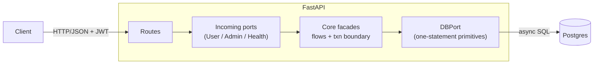
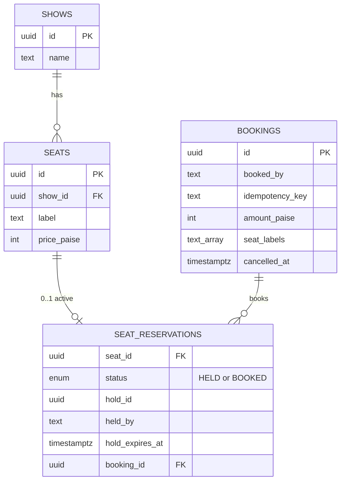

# Seat Booker — High Level Design

A booking API that guarantees **a seat is never held or booked by two users**, even under heavy concurrency.

## 1. Scope

- Admin creates a show with seats and a price. Users view the seat map, **hold** up to 4 seats, **book** (simulated payment), and **cancel**.
- Guarantees: no double hold or double booking; multi-seat holds are all-or-nothing; booking is idempotent; no DB transaction stays open while the user pays.
- Out of scope: real payments, user accounts (JWT only), persistence across restarts.

## 2. Core idea: Postgres row locks

Postgres is both the source of truth and the lock manager. Every write is one short transaction: **LOCK → CHECK → WRITE → COMMIT**.

- `SELECT ... FOR UPDATE` on the requested `seats` rows, **in label order** (no deadlocks). A competing request waits, then sees the committed state and gets `409`.
- A hold is a row with `hold_expires_at`, not an open transaction. Expiry is checked against Postgres `now()` on every read and lock, so correctness never depends on a cleanup job.

```mermaid
sequenceDiagram
    actor A as User A
    actor B as User B
    participant PG as Postgres
    A->>PG: BEGIN; lock A1, A2 FOR UPDATE
    B->>PG: BEGIN; lock A2, A3 FOR UPDATE
    Note over B,PG: blocks on A2
    A->>PG: all free → insert HELD rows; COMMIT
    PG-->>B: lock granted, A2 is HELD
    B->>PG: ROLLBACK → 409 (A3 untouched)
```

## 3. Components



| Layer | Owns |
|---|---|
| **Routes** | HTTP, request/response models, auth (role + user id from the JWT) |
| **Core facades** | The flows: opens `transaction()`, calls primitives step by step, raises 403/404/409 |
| **DBPort / adapter** | SQL: `lock_seats`, `advisory_lock`, `now`, `replace_reservations`, … Core never imports SQLAlchemy |

## 4. API

| Method | Path | Who | Result |
|---|---|---|---|
| `POST` | `/shows` | admin | Create show + seats → `201` |
| `GET` | `/shows/{id}` | user | Seat map: `AVAILABLE` / `HELD` / `BOOKED` |
| `POST` | `/shows/{id}/hold` | user | Hold 1–4 seats → `201 {hold_id, hold_expires_at}`; `409` taken, `403` over limit |
| `DELETE` | `/holds/{id}` | user | Release own hold → `204` (no-op if not theirs) |
| `POST` | `/shows/{id}/reserve` | user | Book seats with `idempotency_key` → `201`; `409` taken |
| `DELETE` | `/bookings/{id}` | user | Cancel own booking → `204` |
| `GET` | `/health`, `/liveness`, `/metrics` | — | Probes, Prometheus metrics |

## 5. Data model



- **Seats are static; state lives in `seat_reservations`.** No row means AVAILABLE; an expired HELD row also counts as AVAILABLE. `seats` stays the lock target because a free seat has no reservation row to lock.
- **Backstops:** partial unique index on `seat_reservations(seat_id) WHERE status IN (HELD, BOOKED)` (one active row per seat); `UNIQUE (booked_by, idempotency_key)` on bookings.

## 6. Flows

**Hold:** advisory lock on `(show, user)` → count the user's active holds (limit 4) → lock seats → any taken? `409` → replace expired rows with HELD rows. The advisory lock stops parallel requests from one user each passing the limit check.

**Book:** advisory lock on `(user, idempotency_key)` → key already used? Replay the original booking (or `409` if the seats differ) → lock seats → taken by someone else? `409` → insert booking, replace rows with BOOKED. A prior hold is optional; the user's own hold is converted. Parallel retries wait on the advisory lock, then replay.

**Cancel:** soft delete. Sets `bookings.cancelled_at` and deletes the reservation rows in one transaction, so the seats become AVAILABLE. Replaying the original key returns the booking with `status: CANCELLED`; it does not re-book.

## 7. Decisions

See [DECISIONS.md](DECISIONS.md): persistence, env defaults, config, workers, hold vs. book flows, and design trade-offs.
