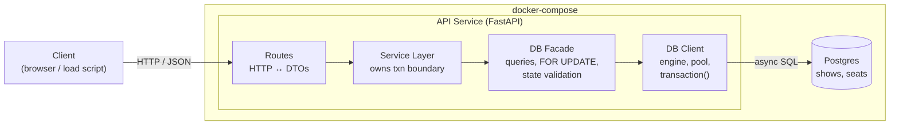
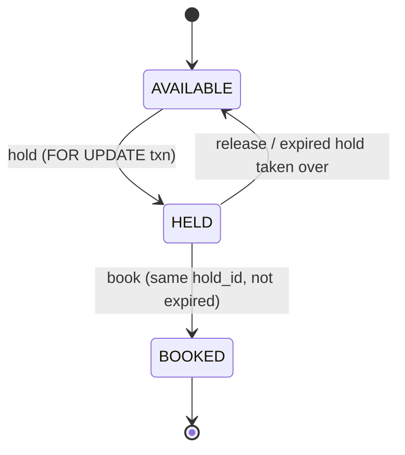
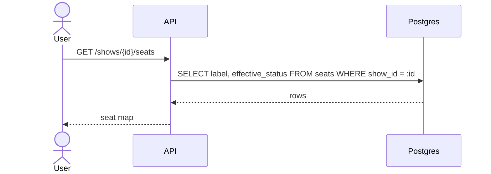
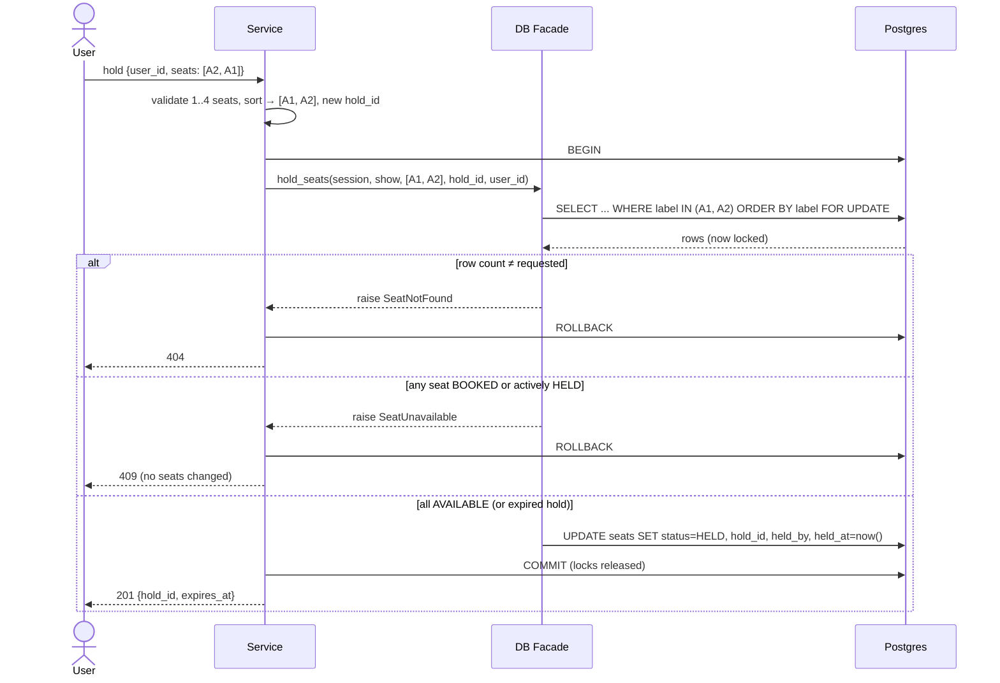
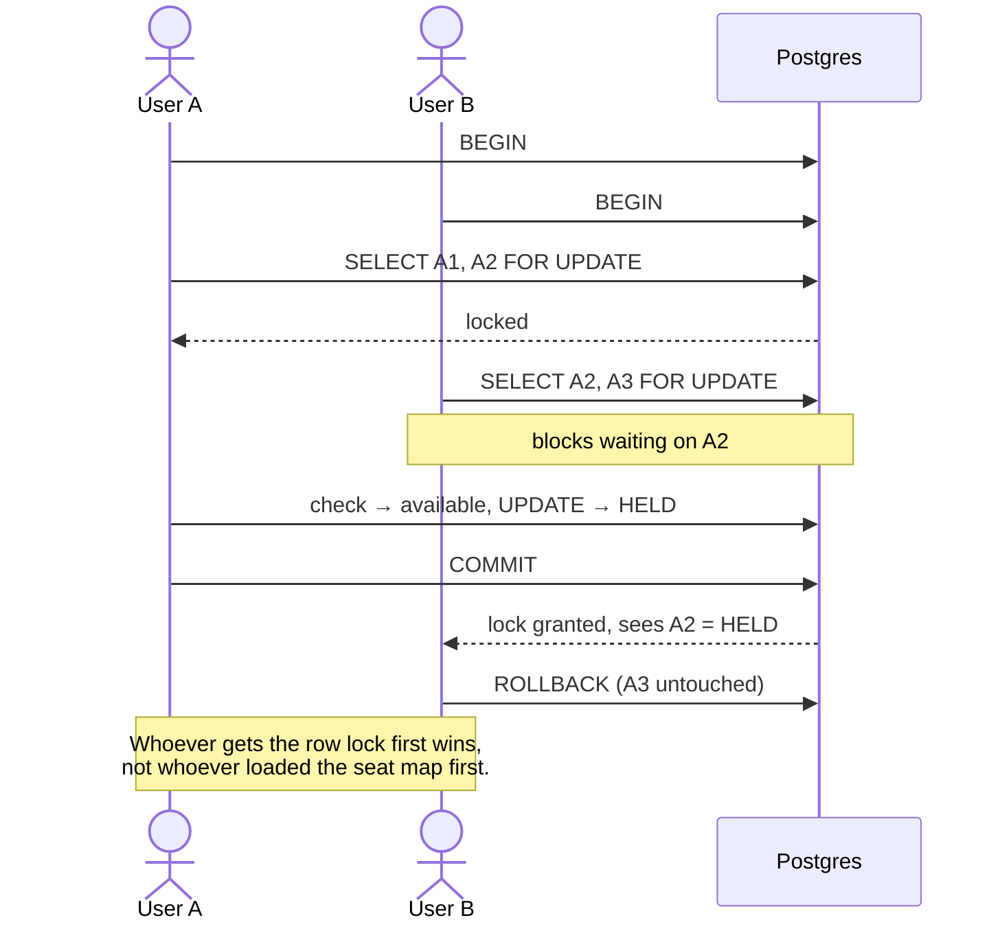
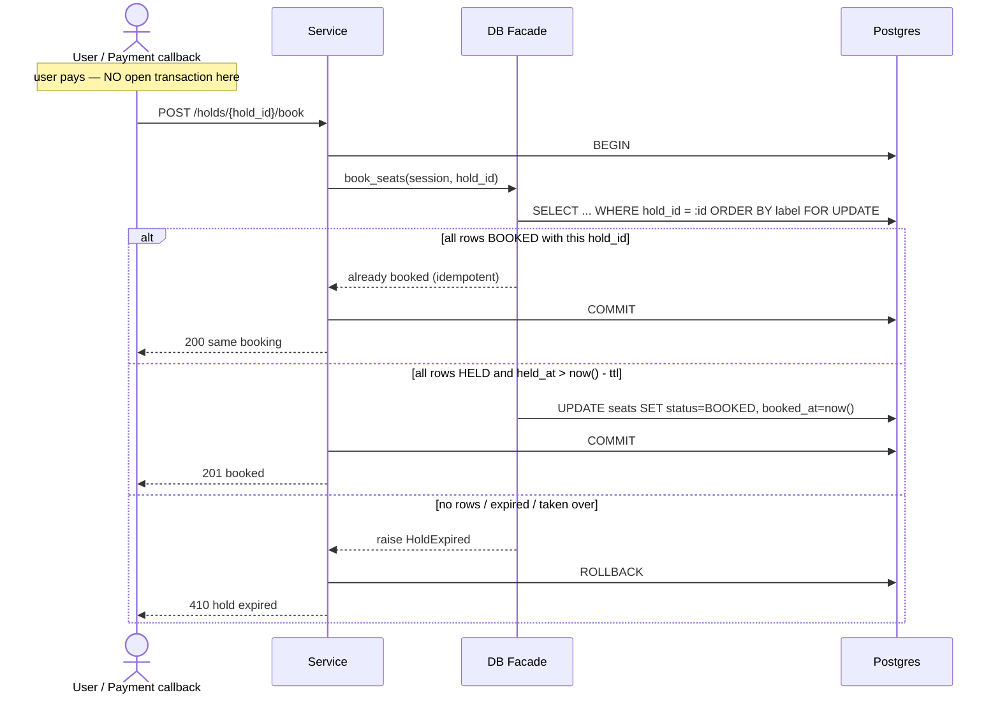
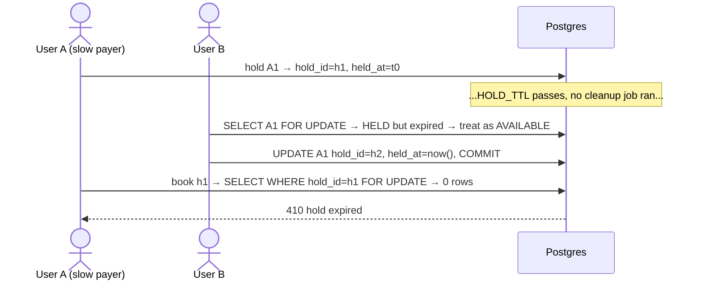
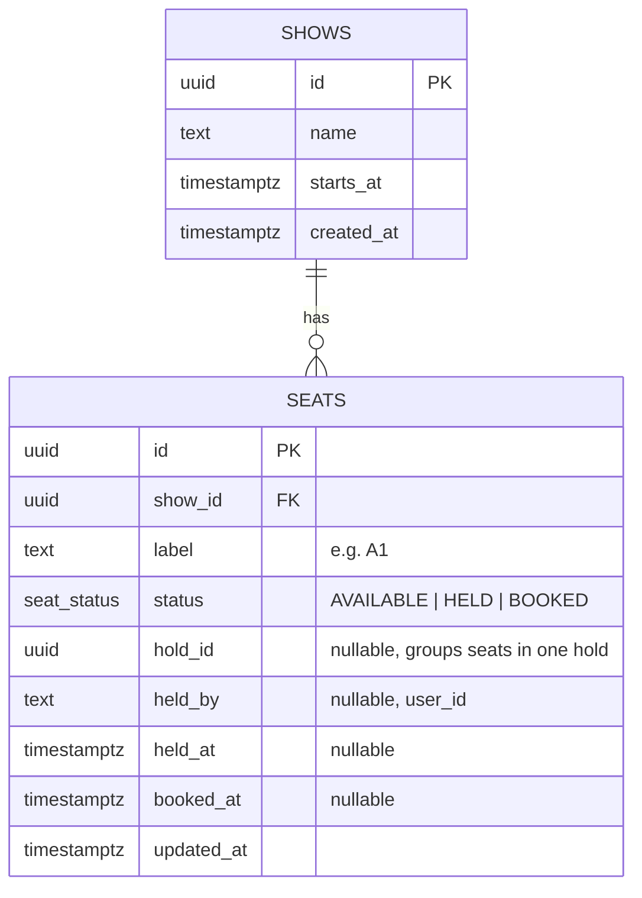

# Seat Booker — High Level Design

A PoC booking app that guarantees **a seat is never held or booked by two users**, even under concurrent requests.

## 1. Goals & Scope

- Users can view seats for a show, **hold** up to 4 seats, then **book** them (simulated payment success).
- Concurrency guarantees:
  - A seat is never held by two users at the same time.
  - A seat is never booked twice.
  - A multi-seat hold is **all-or-nothing**.
  - Transactions are short. No DB transaction stays open while the user pays.
  - Booking is **idempotent**: a repeated confirm returns the same result.
- Out of scope: real payments, auth, multi-region, persistence across restarts.

## 2. Core Idea — Postgres Row Locks

Postgres is the single source of truth **and** the locking mechanism.

- Every concurrency-sensitive operation runs in one short transaction: **LOCK → CHECK → UPDATE → COMMIT**.
- `SELECT ... FOR UPDATE` locks the requested seat rows. A competing transaction waits on the lock, then re-reads the committed state and gets rejected.
- A hold is **persisted state** (`status = HELD`, `held_at`), not an open transaction. Expiry is checked whenever a seat is read or locked, so correctness never depends on a cleanup job.

## 3. Component Diagram



| Layer | Owns | Never does |
|---|---|---|
| **Routes** | Request/response models, HTTP status mapping | Business rules, SQL |
| **Service** | `async with db.transaction()`: decides what runs atomically | Raw SQL |
| **DB Facade** | Queries, `with_for_update()`, state checks, raising domain errors. Takes an `AsyncSession` | `commit()` / `rollback()` |
| **DB Client** | Async engine, connection pool, session factory, `transaction()` context manager (commit on success, rollback on exception) | Knowing about seats or bookings |

## 4. API Surface (high level, will evolve)

| Method | Path | Purpose |
|---|---|---|
| `GET` | `/shows/{show_id}/seats` | Seat map with effective status: `AVAILABLE`, `HELD`, `BOOKED` |
| `POST` | `/shows/{show_id}/holds` | Hold 1–4 seats `{user_id, seat_labels}` → `hold_id` or `409` |
| `POST` | `/holds/{hold_id}/book` | Book the held seats (simulated payment success). Idempotent |
| `DELETE` | `/holds/{hold_id}` | Release a hold early |

## 5. Flow Diagrams

### 5.1 Seat state machine



**Effective status** is computed at read time:

- `BOOKED`: `status = 'BOOKED'`
- `HELD`: `status = 'HELD' AND held_at > now() - HOLD_TTL`
- `AVAILABLE`: everything else, including expired holds

### 5.2 View seats (fresh user)



This is one plain read with no locks. The map is **informational only** and may be stale by the time the user clicks. The hold transaction is the final authority.

```sql
SELECT label,
       CASE
         WHEN status = 'BOOKED' THEN 'BOOKED'
         WHEN status = 'HELD' AND held_at > now() - :ttl THEN 'HELD'
         ELSE 'AVAILABLE'
       END AS effective_status
FROM seats
WHERE show_id = :show_id
ORDER BY label;
```

### 5.3 Hold seats (all-or-nothing)



### 5.4 Concurrency race — two users, overlapping seats



**Lock ordering:** seats are always locked in sorted `label` order (`ORDER BY label FOR UPDATE`). Two overlapping requests then acquire rows in the same sequence, which avoids A1→A2 / A2→A1 deadlocks.

### 5.5 Book seats (idempotent)



### 5.6 Edge case — hold expires, another user takes over



The overwrite of `hold_id` is what invalidates A's hold. No separate cleanup is needed for correctness.

### 5.7 Release hold

`UPDATE seats SET status='AVAILABLE', hold_id=NULL, held_by=NULL, held_at=NULL WHERE hold_id = :id AND status = 'HELD'`

This is a single statement, so it's atomic on its own. If 0 rows match, the hold is already gone and the call is a no-op that returns 204.

## 6. Data Models

### 6.1 Do we need a separate `bookings` table?

**Not for this PoC.** The seat row (per show) is the thing being locked, and it can carry its own hold/booking state:

- One row = one lock target. `FOR UPDATE` on `seats` is enough, with no cross-table consistency to maintain.
- `hold_id` groups a multi-seat hold, so a "booking" is just the set of seats sharing a `hold_id` with `status = BOOKED`.

**When we'd add one:** cancellation/refund history, payment references, or per-booking metadata (price, receipts). Then `bookings(id = hold_id, user_id, status, payment_ref, ...)` would sit beside `seats.hold_id`.

### 6.2 Postgres schema



| Constraint / Index | Why |
|---|---|
| `UNIQUE (show_id, label)` | One row per seat per show. Also the lock-ordering key |
| `status` as enum `seat_status` | Only valid states |
| `CHECK (status = 'AVAILABLE' OR (hold_id IS NOT NULL AND held_by IS NOT NULL AND held_at IS NOT NULL))` | HELD/BOOKED rows always know their hold |
| `CHECK (status <> 'BOOKED' OR booked_at IS NOT NULL)` | BOOKED rows have a timestamp |
| `INDEX (hold_id)` | Fast book/release by hold |

- `HOLD_TTL` (e.g. 10 min) is app config. Expiry = `held_at + HOLD_TTL`, always compared using Postgres `now()`, never app-server time.
- Seed data: one or more shows with a seat grid (e.g. rows A–J × 1–10), inserted on startup.
